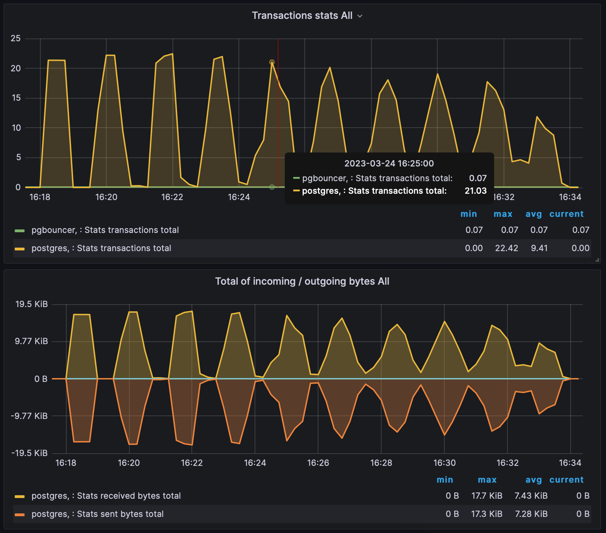

How to run
-

1. docker-compose up -d
2. ./run_siege.sh for generate load

Test results
--

1. With default cache expiration

2. Probabilistic cache expiration (left 60 seconds, 0,5 random value)

3. Probabilistic cache expiration (left 60 seconds, 0,7 random value)

4. Probabilistic cache expiration (left 90 seconds, 0,3 random value)
